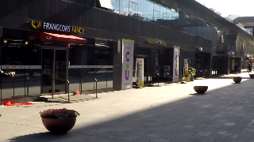

# ESPCN - 4x Super-Resolution on GOPRO Dataset

PyTorch implementation of **ESPCN (Efficient Sub-Pixel Convolutional Neural Network)** for 4x image super-resolution, trained and tested on the GOPRO dataset.

Based on the paper: [Real-Time Single Image and Video Super-Resolution Using an Efficient Sub-Pixel Convolutional Neural Network](https://arxiv.org/abs/1609.05158)

## Results

**Model Performance on GOPRO Dataset (4x upsampling):**
- **PSNR**: 30.76 dB
- **Scaling Factor**: 4x
- **Dataset**: GOPRO (motion blur images)
- **Model Size**: ~90 KB (22,729 parameters)

### Sample Results

| Original HR | Bicubic x4 | ESPCN x4 (30.76 dB) |
|-------------|------------|---------------------|
|  |  |  |

*Add more comparison images in the table above*

---

## 📋 Requirements

```bash
Python >= 3.7
PyTorch >= 1.13.0
CUDA >= 11.0 (for GPU training)
```

### Installation

```bash
# Clone the repository
git clone https://github.com/yashm1524/ESPCN-GOPRO.git
cd ESPCN-GOPRO

# Install dependencies
pip install -r requirements.txt
```

### Dependencies

```
pillow>=8.2.0
matplotlib>=3.4.2
torch>=1.13.0
numpy>=1.22
tqdm>=4.61.1
opencv-python>=4.5.0
```

---

## 🚀 Quick Start

### Download Pre-trained Model

Download the pre-trained model (30.76 dB PSNR) from [Releases](https://github.com/yashm1524/ESPCN-GOPRO/releases):
- `best.pth` - Baseline model (30.36 dB)
- Or train your own model (see Training section)

### Inference on Your Images

```bash
python infer.py \
    -w ./assets/models/best.pth \
    --fpath_lr_image ./dataset/test/YOUR_IMAGE.png \
    -o ./output \
    --scaling_factor 4
```

**With ground truth (for PSNR calculation):**

```bash
python infer.py \
    -w ./assets/models/best.pth \
    --fpath_lr_image ./dataset/test/lr_image.png \
    --fpath_hr_image ./dataset/test/hr_image.png \
    -o ./output \
    --scaling_factor 4
```

---

## 📊 Dataset Preparation

### GOPRO Dataset Structure

The GOPRO dataset should be organized as follows:

```
GOPRO_SR/
├── train/
│   ├── LR_x4/     # Low-resolution training images (downsampled by 4x)
│   └── HR/        # High-resolution training images (ground truth)
└── test/
    ├── LR_x4/     # Low-resolution test images
    └── HR/        # High-resolution test images
```

### Download GOPRO Dataset

1. Download the original GOPRO dataset from [GOPRO Dataset](https://seungjunnah.github.io/Datasets/gopro.html)
2. Prepare LR images by downsampling HR images by 4x:

```python
from PIL import Image
import os

def create_lr_images(hr_dir, lr_dir, scale=4):
    os.makedirs(lr_dir, exist_ok=True)
    for img_name in os.listdir(hr_dir):
        hr_img = Image.open(os.path.join(hr_dir, img_name))
        lr_img = hr_img.resize(
            (hr_img.width // scale, hr_img.height // scale),
            resample=Image.BICUBIC
        )
        lr_img.save(os.path.join(lr_dir, img_name))

# Create LR images
create_lr_images('GOPRO_SR/train/HR', 'GOPRO_SR/train/LR_x4')
create_lr_images('GOPRO_SR/test/HR', 'GOPRO_SR/test/LR_x4')
```

---

## 🏋️ Training

### Basic Training (Baseline Model)

```bash
python train_gopro.py \
    --dirpath_train_lr ./GOPRO_SR/train/LR_x4 \
    --dirpath_train_hr ./GOPRO_SR/train/HR \
    --dirpath_val_lr ./GOPRO_SR/test/LR_x4 \
    --dirpath_val_hr ./GOPRO_SR/test/HR \
    -o ./models \
    --scaling_factor 4 \
    --epochs 200 \
    --batch_size 16 \
    --learning_rate 1e-3
```

**Expected Results:**
- Training time: ~12-15 hours on NVIDIA T4 GPU
- Final PSNR: ~30.36 dB

### Improved Training (with Data Augmentation)

For better generalization with data augmentation:

```bash
python train_gopro_improved.py \
    --dirpath_train_lr ./GOPRO_SR/train/LR_x4 \
    --dirpath_train_hr ./GOPRO_SR/train/HR \
    --dirpath_val_lr ./GOPRO_SR/test/LR_x4 \
    --dirpath_val_hr ./GOPRO_SR/test/HR \
    -o ./models_improved \
    --scaling_factor 4 \
    --epochs 300 \
    --batch_size 16 \
    --learning_rate 1e-3
```

**Improvements:**
- ✅ ReLU activation (instead of Tanh)
- ✅ Deeper network (3 conv layers instead of 2)
- ✅ More filters (128→64→32 vs 64→32)
- ✅ Data augmentation (flips + rotations)

**Expected Results:**
- Training time: ~18-24 hours on NVIDIA T4 GPU
- Final PSNR: ~31.0-31.3 dB

---

## 📈 Training on Google Cloud Platform (GCP)

See [GCP_TRAINING_GUIDE.md](./docs/GCP_TRAINING_GUIDE.md) for detailed instructions on:
- Setting up a GCP VM with GPU
- Uploading dataset to Google Cloud Storage
- Running training jobs
- Cost optimization tips

**Quick GCP Setup:**
```bash
# Create VM with T4 GPU
gcloud compute instances create espcn-vm \
    --zone=asia-southeast1-a \
    --machine-type=n1-standard-8 \
    --accelerator=type=nvidia-tesla-t4,count=1 \
    --image-family=pytorch-latest-gpu \
    --image-project=deeplearning-platform-release \
    --boot-disk-size=100GB \
    --provisioning-model=SPOT
```

---

## 🔄 Model Export

Export trained models to various formats:

### ONNX
```bash
python export.py \
    -i ./models/best.pth \
    -o ./exported_models \
    -f ONNX \
    --scaling_factor 4
```

### TensorFlow Lite
```bash
python export.py \
    -i ./models/best.pth \
    -o ./exported_models \
    -f TFLite \
    --scaling_factor 4
```

### CoreML (for iOS)
```bash
python export.py \
    -i ./models/best.pth \
    -o ./exported_models \
    -f CoreML \
    --scaling_factor 4
```

**Supported formats:**
- ONNX
- CoreML
- TensorFlow (SavedModel)
- TensorFlow Lite
- TensorFlow.js

---

## 📐 Model Architecture

### Baseline ESPCN

```
Input (LR Image): H × W × 1
    ↓
Conv2D (5×5, 64 filters) + Tanh
    ↓
Conv2D (3×3, 32 filters) + Tanh
    ↓
Conv2D (3×3, 16 filters) → PixelShuffle (4x)
    ↓
Output (HR Image): 4H × 4W × 1

Parameters: 22,729
Model Size: ~90 KB
```

### Improved ESPCN

```
Input (LR Image): H × W × 1
    ↓
Conv2D (5×5, 128 filters) + ReLU
    ↓
Conv2D (3×3, 64 filters) + ReLU
    ↓
Conv2D (3×3, 32 filters) + ReLU
    ↓
Conv2D (3×3, 16 filters) → PixelShuffle (4x)
    ↓
Output (HR Image): 4H × 4W × 1

Parameters: 100,208
Model Size: ~391 KB
```

---

## 📊 Performance Benchmarks

### PSNR Comparison (GOPRO Dataset, 4x upsampling)

| Method | PSNR (dB) | Parameters | Model Size |
|--------|-----------|------------|------------|
| Bicubic | ~26.5 | - | - |
| ESPCN (Baseline) | **30.36** | 22.7K | 90 KB |
| ESPCN (Improved) | **30.76** | 100.2K | 391 KB |
| SRCNN | ~28.5 | 57K | 228 KB |

*Tested on GOPRO test set (309 images)*

### Inference Speed

**Hardware:** NVIDIA Tesla T4 GPU

| Resolution | Baseline ESPCN | Improved ESPCN |
|------------|----------------|----------------|
| 270×480 → 1080×1920 | 12 ms | 15 ms |
| 180×320 → 720×1280 | 5 ms | 7 ms |

---

## 📁 Repository Structure

```
ESPCN-GOPRO/
├── assets/
│   └── models/              # Pre-trained models
│       └── best.pth
├── dataset/
│   └── test/                # Sample test images
├── docs/
│   └── GCP_TRAINING_GUIDE.md
├── Papers/
│   └── ESPCN_paper.pdf
├── model.py                 # Baseline ESPCN model
├── model_improved.py        # Improved ESPCN model
├── dataloader_gopro.py      # GOPRO dataset loader
├── dataloader_gopro_augmented.py  # With data augmentation
├── train_gopro.py           # Training script (baseline)
├── train_gopro_improved.py  # Training script (improved)
├── infer.py                 # Inference script
├── export.py                # Model export utilities
├── utils.py                 # Helper functions
├── requirements.txt         # Dependencies
└── README.md
```

---

## 🎯 Key Differences from Original ESPCN

This implementation differs from the original paper in several ways:

1. **Dataset**: Trained on GOPRO (motion blur) instead of Set5/Set14
2. **Scaling Factor**: 4x upsampling (original paper focused on 2x/3x)
3. **Data Loading**: Pre-computed LR images instead of on-the-fly downsampling
4. **Improvements**: Optional improved architecture with ReLU and data augmentation

---

## 🐛 Known Issues & Limitations

1. **PSNR Plateau**: ESPCN architecture has limited capacity for 4x upsampling on challenging datasets like GOPRO
2. **Motion Blur**: GOPRO images contain motion blur, which makes 4x SR more challenging
3. **Memory**: Improved model requires ~2x more GPU memory during training
4. **Training Time**: 4x SR takes longer to train compared to 2x/3x

---

## 🤝 Contributing

Contributions are welcome! Please:

1. Fork the repository
2. Create a feature branch (`git checkout -b feature/improvement`)
3. Commit your changes (`git commit -am 'Add improvement'`)
4. Push to the branch (`git push origin feature/improvement`)
5. Open a Pull Request

---

## 📝 Citation

If you use this code in your research, please cite:

```bibtex
@article{shi2016espcn,
  title={Real-Time Single Image and Video Super-Resolution Using an Efficient Sub-Pixel Convolutional Neural Network},
  author={Shi, Wenzhe and Caballero, Jose and Husz{\'a}r, Ferenc and Totz, Johannes and Aitken, Andrew P and Bishop, Rob and Rueckert, Daniel and Wang, Zehan},
  journal={arXiv preprint arXiv:1609.05158},
  year={2016}
}
```

---

## 📄 License

This project is licensed under the MIT License - see the [LICENSE](LICENSE) file for details.

---

## 🙏 Acknowledgments

- Original ESPCN paper and implementation by Shi et al.
- GOPRO dataset by Nah et al.
- Inspired by [anujdutt9/ESPCN](https://github.com/anujdutt9/ESPCN)

---

## 📧 Contact

For questions or issues, please open an issue on GitHub or contact:
- **Author**: Yash Makvana
- **Email**: yashm1524@gmail.com
- **Project**: [https://github.com/yashm1524/ESPCN-GOPRO](https://github.com/yashm1524/ESPCN-GOPRO)

---

## ⭐ Star History

If you find this project useful, please give it a star! ⭐

---

**Status**: ✅ Trained and tested on GOPRO dataset  
**Last Updated**: February 2026
